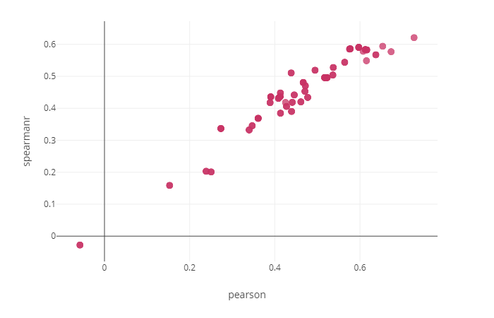
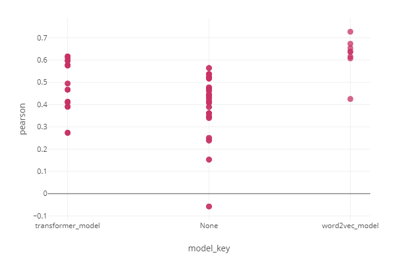
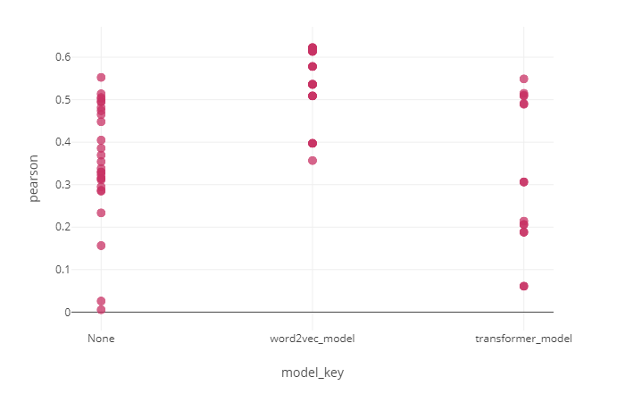
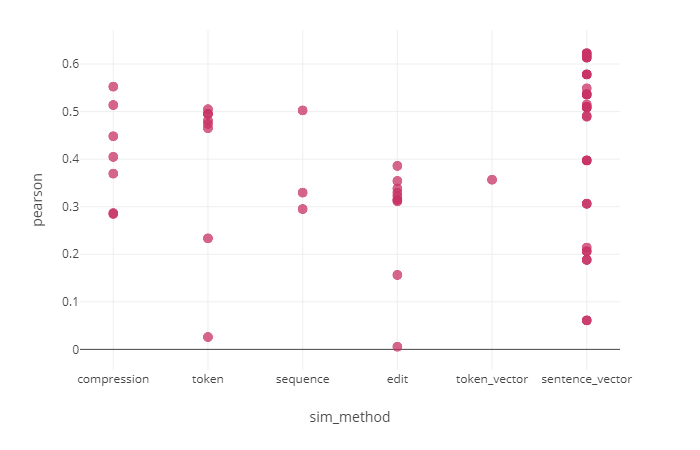
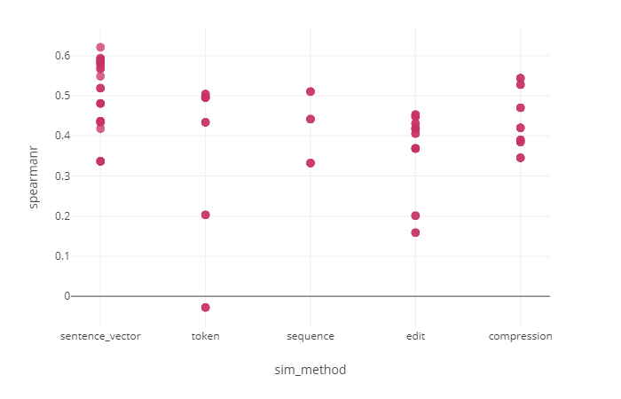
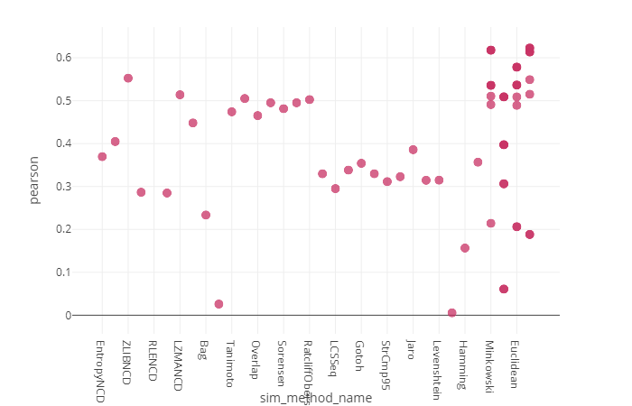
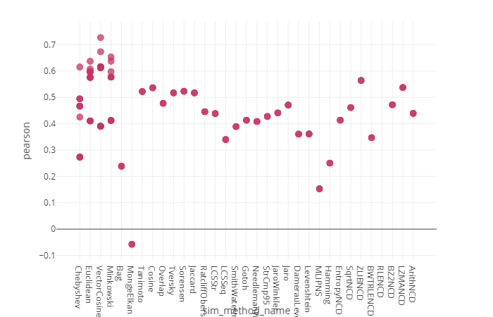

# 文本相似度初探
我们开始讨论测量文本相似度问题，特别是短文本相似度问题，我们的问题是比较一般化的问题:给定训练文本(比如若干句子对），测试文本（比如若干句子对）以及对应的标签（比如句子对的相似程度，数值表示），我们需要利用一些方法在训练数据上进行无监督的训练或不训练，然后在测试文本上进行测试，以确定什么是好的测量文本相似性的方法。

由于文本相似方法数量庞大，既包括各种基础的相似性测量方法，也有各种以神经网络为基础的文本匹配方法，我们不去一一列举，我们选择从实验出发，实验若干基础方法。

给定输入文本，为了输出相似度，我们将文本相似测量方法分为两核心阶段：文本表示阶段和相似性计算阶段，我们分别总结一些基础方法，并进行组合，最后利用典型数据:http://ixa2.si.ehu.es/stswiki/index.php/STSbenchmark 和
https://github.com/nlptown/nlp-notebooks/blob/master/Simple%20Sentence%20Similarity.ipynb 中的SICK和STS数据来进行实验评估。

## 文本表示
文本有若干种表示方法，如原始表示，token集合表示，词向量集合表示，句子向量表示等。原始表示就是指文本原始的字符串，token集合是指文本（比如一个句子）经过分词和其他处理后形成的token集合，词向量集合表示指文本（比如一个句子）经过词向量模型转后得到的词向量的集合，句子向量表示等指文本（比如一个句子）经过transformers，主题模型等转换后得到的句子向量表示,我们把这些表示方法列出来：

| 表示方法类别   | 模型            |
| -------------- | --------------- |
| 原始表示       |                 |
| token集合表示  | ngram           |
| 词向量集合表示 | word2vec家族    |
| 句子向量表示   | transformer家族 |

## 相似度计算
我们有许多的相似度计算方法，在https://github.com/life4/textdistance 的划分基础上，我们稍加修改，相似度计算方法可分为基于字符串的，基于句子向量的，基于压缩的，基于编辑的，基于token的和基于词向量的方法。我们不去一一解释这些方法，因为这些基础方法可以很方便的在textdistance包和其他地方搜索到。
我们列出来:

| 相似度计算类别 | 方法列表                                                     |
| -------------- | ------------------------------------------------------------ |
| 基于压缩的     | ArithNCD, LZMANCD,BZ2NCD,RLENCD,BWTRLENCD,ZLIBNCD,SqrtNCD,EntropyNCD |
| 基于编辑的     | Hamming,MLIPNS,Levenshtein, DamerauLevenshtein,Jaro, JaroWinkler, StrCmp95,NeedlemanWunsch, Gotoh, SmithWaterman |
| 基于词向量的   | WmdDistance                                                  |
| 基于token的    | Jaccard, Sorensen, Tversky,Overlap, Cosine, Tanimoto, MongeElkan, Bag |
| 基于句子向量的 | Chebyshev, Minkowski, Euclidean, Cosine                      |

## 预处理和后处理方法
除了文本表示和相似度计算方法我们还需要预处理和后处理阶段才能形成完整的相似度计算流程，对于预处理阶段我们仅使用三种种：不处理或分词或去除停用词；对于后处理阶段，我们对词向量模型和transformer模型的结果做一些处理以方便能使用不同的相似度计算方法，如：基于词向量的方法或基于句子向量的方法。

| 预处理方法     |
| -------------- |
| tokenize(分词) |
| move_stopword  |

| 模型        | 后处理方法                                                   |
| ----------- | ------------------------------------------------------------ |
| word2vec    | Avg(平均化所有词向量），Maxpool(对于多个词向量的每个维度取最大的) |
| transformer | Avg(平均化所有输出向量），Maxpool(对于多个输出向量的每个维度取最大的)，SelectOne(取第一个输出向量：即[cls]字符代表的向量，其他的不用。) |

## 实验

好了，有了预处理，文本表示，后处理，相似度计算方法，我们就可以依次连接它们，进行不同的组合，形成不同的文本相似度计算的pipeline，即：完整的文本相似度计算流程，随后依此进行试验。

### 评价指标

我们使用皮尔逊相关系数和斯皮尔曼等级相关系数来衡量预测的相似度和真正的相似度的差异，相似度越高我们就就认为该种方法越好，这是两种可以无视相似度数值范围的评价指标。

    
     
    

      图1 sts数据集的皮尔逊相关系数和斯皮尔曼等级系数
    

如图1，本次实验中皮尔逊相关系数和斯皮尔曼等级相关系数呈现比较一致的正相关，同样的反映了方法的效果，所以后续我们仅利用皮尔逊相关系数指标进行说明。

    
     
    

      图2 不同种类表示方法在sick数据集的皮尔逊相关系数，None代表非向量表示。
    

    
     
    

      图3 不同种类表示方法在sts数据集的皮尔逊相关系数，None代表非向量表示。
    

我们注意到word2vec在两个数据集上都取得了最好的效果，最好的效果是word2vec+maxpool/Avg+consin方法达到的。

    
     
    

      图4 不同种类相似度计算方法在sts数据集的皮尔逊相关系数。
    

    
     
    

      图5 不同种类相似度计算方法在sick数据集的皮尔逊相关系数。
    

    
     
    

      图6 不同相似度计算方法在sts数据集的皮尔逊相关系数。
    

    
     
    

      图7 不同相似度计算方法在sick数据集的皮尔逊相关系数。
    

图4-7表明，基于向量的计算方法可以取得最好的效果，非向量计算方法中，ZLIBNCD,LZMANCD这两种基于压缩的方法效果较好，并且他们不需要训练，使用方便。

# 进一步讨论

## word2vec为何优于transformer?

## 非学习方法中基于压缩的方法为何力压其他相似度计算方法？